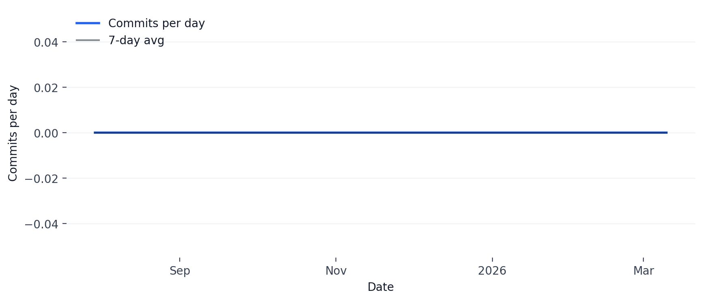

# Forensic Media Detection (FMD) Tool - Technical Documentation

<!-- Badges -->

[](https://github.com/RajaMuhammadAwais/Forensic-Media-Detection/releases)
[](https://opensource.org/licenses/MIT)

[](https://github.com/RajaMuhammadAwais/Forensic-Media-Detection)

[](https://github.com/RajaMuhammadAwais/Forensic-Media-Detection/pulls)


## 1. Overview

The Forensic Media Detection (FMD) Tool is a comprehensive AI & ML-driven system designed to detect deepfake artifacts across multiple media modalities. The tool employs state-of-the-art deep learning techniques to analyze images, videos, and audio files for signs of manipulation or synthetic generation.

## 2. System Architecture

The FMD tool follows a modular architecture with the following key components:

```
fmd_tool/
├── image_forensics/
│   └── image_detector.py
├── video_forensics/
│   └── video_detector.py
├── audio_forensics/
│   └── audio_detector.py
├── multimodal_analysis/
│   └── multimodal_detector.py
├── cli/
│   └── fmd_cli.py
├── tests/
│   ├── test_image_detector.py
│   ├── test_video_detector.py
│   ├── test_audio_detector.py
│   └── test_multimodal_detector.py
├── data/
│   └── (test files and datasets)
└── documentation/
    ├── user_manual.md
    └── technical_documentation.md
```

## 3. Image Forensics Module

### 3.1. Architecture

The Image Forensics module implements three primary detection approaches:

1. **Vision Transformer (ViT) Classifier**: A PyTorch-based ViT model for state-of-the-art generalization.
2. **XceptionNet-based Classifier**: A TensorFlow-based Xception model fine-tuned for deepfake detection.
3. **Autoencoder-based Anomaly Detection**: An autoencoder that learns to reconstruct authentic images and flags anomalies.

### 3.2. Key Features

- **Pixel-level Inconsistency Detection**: Uses gradient analysis to identify anomalous pixel patterns
- **Lighting Consistency Analysis**: Analyzes lighting distribution across image regions
- **Preprocessing Pipeline**: Standardized image preprocessing for consistent model input

### 3.3. Model Details

**XceptionNet Configuration:**
- Input Shape: (256, 256, 3)
- Base Model: Xception (pre-trained on ImageNet)
- Fine-tuning: Last 20 layers unfrozen
- Output: Single sigmoid neuron for binary classification

**Autoencoder Configuration:**
- Encoder: 4 Conv2D layers with max pooling
- Decoder: 4 Conv2DTranspose layers with upsampling
- Loss Function: Mean Squared Error (MSE)

## 4. Video Forensics Module

### 4.1. Architecture

The Video Forensics module employs a CNN-LSTM hybrid architecture for temporal anomaly detection:

1. **Frame Extraction**: Systematic sampling of video frames
2. **CNN Feature Extraction**: Spatial feature extraction from individual frames
3. **LSTM Temporal Modeling**: Analysis of temporal patterns across frames

### 4.2. Key Features

- **Temporal Anomaly Detection**: Identifies inconsistencies in frame sequences
- **Lip-Sync Analysis**: Detects audio-visual synchronization mismatches
- **Frame-by-Frame Analysis**: Detailed examination of individual frames

### 4.3. Model Details

**CNN-LSTM Configuration:**
- Input Shape: (sequence_length, 256, 256, 3)
- CNN Layers: 3 Conv2D layers (64, 128, 256 filters)
- LSTM Layers: 2 LSTM layers (128, 64 units)
- Output: Single sigmoid neuron for binary classification

## 5. Audio Forensics Module

### 5.1. Architecture

The Audio Forensics module implements x-vector inspired architecture for speaker verification and synthetic speech detection:

1. **Feature Extraction**: MFCC (Mel-Frequency Cepstral Coefficients) extraction
2. **Frame-level Processing**: Conv1D layers for local feature extraction
3. **Statistics Pooling**: Mean and standard deviation pooling across time
4. **Segment-level Processing**: Dense layers for final classification

### 5.2. Key Features

- **Spectral Anomaly Detection**: Analysis of frequency domain characteristics
- **Voice Synthesis Detection**: Identification of synthetic speech artifacts
- **Speaker Verification**: Comparison against known speaker profiles

### 5.3. Model Details

**X-Vector Configuration:**
- Input Shape: (None, 20) - Variable length MFCC sequences
- Frame-level: 3 Conv1D layers (512 filters each)
- Statistics Pooling: Mean and standard deviation concatenation
- Segment-level: 2 Dense layers (512 units each)
- Output: Single sigmoid neuron for binary classification

## 6. Multimodal Analysis Module

### 6.1. Architecture

The Multimodal Analysis module implements late fusion for combining predictions from individual modality detectors:

1. **Individual Modality Analysis**: Separate analysis using specialized detectors
2. **Cross-Modal Consistency Check**: Analysis of prediction consistency across modalities
3. **Ensemble Prediction**: Weighted combination of individual predictions

### 6.2. Key Features

- **Late Fusion**: Combines high-level predictions from individual modalities
- **Consistency Analysis**: Identifies outlier predictions that may indicate manipulation
- **Confidence Scoring**: Provides confidence estimates based on cross-modal agreement

### 6.3. Fusion Model Details

**Late Fusion Configuration:**
- Inputs: 3 prediction scores (image, video, audio)
- Hidden Layers: 2 Dense layers (64, 32 units) with dropout
- Output: Single sigmoid neuron for final prediction

## 7. Command Line Interface

### 7.1. Design

The CLI is built using the Click library and provides a user-friendly interface for accessing all FMD functionalities:

- **Modular Commands**: Separate commands for each analysis type
- **Flexible Options**: Configurable models and output formats
- **Error Handling**: Comprehensive error messages and validation

### 7.2. Implementation Details

- **Click Framework**: Provides command parsing and help generation
- **JSON Output**: Structured output format for programmatic access
- **Progress Indicators**: User feedback during analysis

## 8. Testing Framework

### 8.1. Unit Tests

Each module includes comprehensive unit tests covering:
- Model initialization and building
- Feature extraction and preprocessing
- Prediction functionality
- Error handling

### 8.2. Integration Tests

End-to-end testing of the complete pipeline:
- CLI command execution
- File I/O operations
- Cross-module interactions

## 9. Performance Considerations

### 9.1. Optimization Strategies

- **Model Quantization**: Reduced precision for faster inference
- **Batch Processing**: Efficient handling of multiple files
- **Memory Management**: Careful handling of large media files

### 9.2. Scalability

- **Modular Design**: Easy addition of new detection methods
- **Configurable Models**: Support for different model architectures
- **Extensible Framework**: Plugin architecture for custom detectors

## 10. Supported Pretrained Models

You can use the following pretrained models with the FMD tool for each modality:

### Image Forensics
- **Vision Transformer (ViT)** (recommended for generalization):
  - Based on the latest research, ViT models offer superior cross-dataset generalization.
  - Uses a pre-trained ViT-B/16 backbone (PyTorch).
- **XceptionNet**:
  - Pretrained on ImageNet, widely used for deepfake detection (e.g., FaceForensics++, DeepFakeDetection).
  - Download from: [Keras Applications](https://keras.io/api/applications/xception/) or [DeepFakeDetection Challenge](https://www.kaggle.com/c/deepfake-detection-challenge/data)
- **Autoencoder**:
  - You can use any convolutional autoencoder trained on authentic images from your domain.

### Video Forensics
- **CNN-LSTM**:
  - Use a CNN (e.g., Xception, ResNet50) for frame feature extraction, pretrained on ImageNet.
  - LSTM weights can be trained on video deepfake datasets (e.g., FaceForensics++, DFDC).
  - Example: [DeepFakeDetection](https://github.com/ondyari/FaceForensics) or [Kaggle DFDC](https://www.kaggle.com/c/deepfake-detection-challenge/data)

### Audio Forensics
- **X-Vector**:
  - Pretrained x-vector models for speaker verification (e.g., Kaldi x-vector, SpeechBrain).
  - Download from: [SpeechBrain Pretrained Models](https://huggingface.co/speechbrain) or [Kaldi VoxCeleb](https://kaldi-asr.org/models/m7)
- **CNN-LSTM**:
  - You can use a CNN-LSTM trained for audio deepfake detection (e.g., ASVspoof challenge models).

### Multimodal Fusion
- **Late Fusion**:
  - The fusion model can be trained using outputs from the above pretrained models on a multimodal dataset.

## 11. Dependencies

### 10.1. Core Libraries

- **TensorFlow**: Deep learning framework for model implementation (used for Xception and Autoencoder)
- **PyTorch**: Deep learning framework for model implementation (used for Vision Transformer)
- **OpenCV**: Computer vision operations for image and video processing
- **Librosa**: Audio processing and feature extraction
- **Scikit-learn**: Machine learning utilities and preprocessing
- **NumPy/Pandas**: Numerical computing and data manipulation

### 10.2. CLI Libraries

- **Click**: Command-line interface creation
- **Pillow**: Image processing utilities

## 11. Future Enhancements

### 11.1. Planned Features

- **Early Fusion**: Feature-level fusion for improved accuracy
- **Real-time Processing**: Streaming analysis capabilities
- **Model Training Pipeline**: Automated training on new datasets
- **Web Interface**: Browser-based user interface

### 11.2. Research Directions

- **Adversarial Robustness**: Defense against adversarial attacks
- **Explainable AI**: Interpretable detection results
- **Cross-dataset Generalization**: Improved performance across different datasets (partially addressed by ViT model)

## 12. GitHub Analytics Charts

This repository automatically generates a daily commit activity graph via GitHub Actions. The workflow runs on a schedule and updates the image at the root of the repo.

Current auto-generated chart:


```

Notes:
- The GitHub Action defined in .github/workflows/update-activity-graph.yml installs minimal dependencies, generates assets/graph.png, and commits it back to the repository.
- If you fork this repo, ensure Actions are enabled in your fork and that the default branch has workflow permissions to write contents.

  # Forensic Media Detection (FMD) Tool - User Manual

## 1. Introduction

The Forensic Media Detection (FMD) Tool is an AI & ML-driven command-line interface (CLI) application designed to detect deepfake artifacts in various media types, including images, videos, and audio files. This tool leverages advanced machine learning models to analyze media for inconsistencies and anomalies that may indicate manipulation.

## 2. Installation

To use the FMD Tool, you need to have Python 3.8+ installed on your system. It is recommended to use a virtual environment to manage dependencies.

```bash
# Clone the repository (if applicable)
# git clone <repository_url>
# cd fmd_tool

# Create a virtual environment
python3.11 -m venv venv
source venv/bin/activate  # On Windows, use `venv\Scripts\activate`

# Install dependencies
pip install tensorflow torch opencv-python scikit-learn librosa click numpy pandas matplotlib seaborn pydub
```

## 3. Usage

The FMD Tool is accessed via the `fmd` command, which provides subcommands for analyzing different media types. Below are the available commands and their options.

### 3.1. General Options

*   `--version`: Show the version and exit.

### 3.2. Image Analysis (`fmd image`)

This command analyzes image files for deepfake artifacts and manipulation.

**Usage:**

```bash
fmd image --check <path_to_image_file> [OPTIONS]
```

**Options:**

*   `--check <path_to_image_file>`: **(Required)** Path to the image file to analyze.
*   `--model <model_name>`: Model to use for analysis. Supported models: `xception` (default), `autoencoder`.
*   `--detect <detection_type>`: Type of detection to perform. Default: `deepfake`.
*   `--output <output_file>`: Path to save the analysis results in JSON format.

**Example:**

```bash
fmd image --check my_image.jpg --model xception --output results.json
```

### 3.3. Video Analysis (`fmd video`)

This command analyzes video files for deepfake artifacts and manipulation.

**Usage:**

```bash
fmd video --check <path_to_video_file> [OPTIONS]
```

**Options:**

*   `--check <path_to_video_file>`: **(Required)** Path to the video file to analyze.
*   `--model <model_name>`: Model to use for analysis. Supported models: `cnn_lstm` (default).
*   `--detect <detection_type>`: Type of detection to perform. Default: `deepfake`.
*   `--output <output_file>`: Path to save the analysis results in JSON format.

**Example:**

```bash
fmd video --check my_video.mp4 --model cnn_lstm
```

### 3.4. Audio Analysis (`fmd audio`)

This command analyzes audio files for synthetic voice and manipulation.

**Usage:**

```bash
fmd audio --check <path_to_audio_file> [OPTIONS]
```

**Options:**

*   `--check <path_to_audio_file>`: **(Required)** Path to the audio file to analyze.
*   `--model <model_name>`: Model to use for analysis. Supported models: `xvector` (default), `cnn_lstm`.
*   `--detect <detection_type>`: Type of detection to perform. Default: `deepfake`.
*   `--output <output_file>`: Path to save the analysis results in JSON format.

**Example:**

```bash
fmd audio --check my_audio.wav --model xvector
```

### 3.5. Multimodal Analysis (`fmd multimodal`)

This command performs a comprehensive analysis across multiple modalities (image, video, audio) if available in the media file.

**Usage:**

```bash
fmd multimodal --check <path_to_media_file> [OPTIONS]
```

**Options:**

*   `--check <path_to_media_file>`: **(Required)** Path to the media file to analyze.
*   `--model <model_name>`: Model to use for fusion. Supported models: `fusion_model` (default).
*   `--output <output_file>`: Path to save the analysis results in JSON format.

**Example:**

```bash
fmd multimodal --check my_media.mp4
```

### 3.6. Information (`fmd info`)

This command displays information about the FMD tool, including supported analysis types and usage examples.

**Usage:**

```bash
fmd info
```

**Example:**

```bash
fmd info
```

## 4. Output Interpretation

The FMD tool provides detailed analysis results, typically in JSON format when the `--output` option is used. The output includes:

*   **Deepfake Probability:** A score indicating the likelihood of the media being a deepfake.
*   **Specific Anomalies:** Details about detected inconsistencies in pixels, lighting, frame-by-frame analysis, lip-sync, voice mismatch, and synthetic speech artifacts.
*   **Overall Assessment:** A summary recommendation (e.g., "DEEPFAKE DETECTED", "SUSPICIOUS", "LIKELY AUTHENTIC").

## 5. Troubleshooting

*   **"File not found" error:** Ensure the path to your media file is correct and the file exists.
*   **Dependency issues:** If you encounter errors related to missing libraries, try reinstalling them using `pip install -r requirements.txt` (if a `requirements.txt` is provided) or the individual `pip install` commands listed in the Installation section.
*   **Model loading errors:** Ensure you have sufficient memory and the correct TensorFlow/PyTorch versions installed. Some models might require pre-trained weights, which may need to be downloaded separately.

For further assistance, please refer to the project's documentation or contact support.


